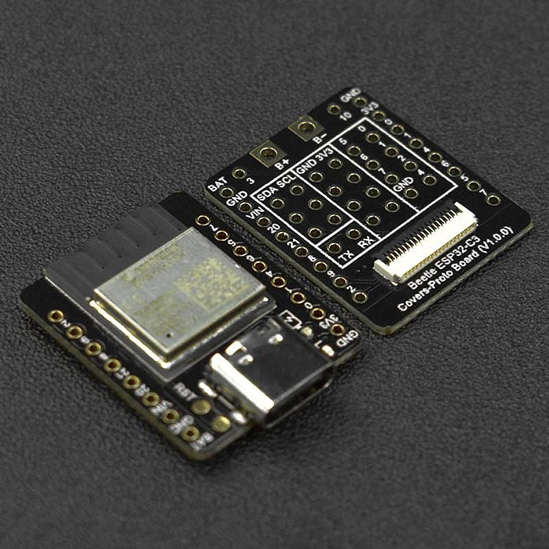
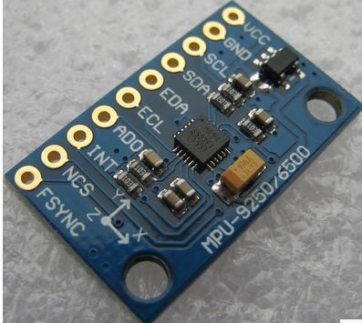
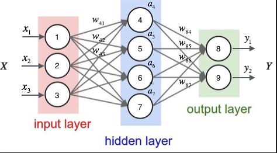
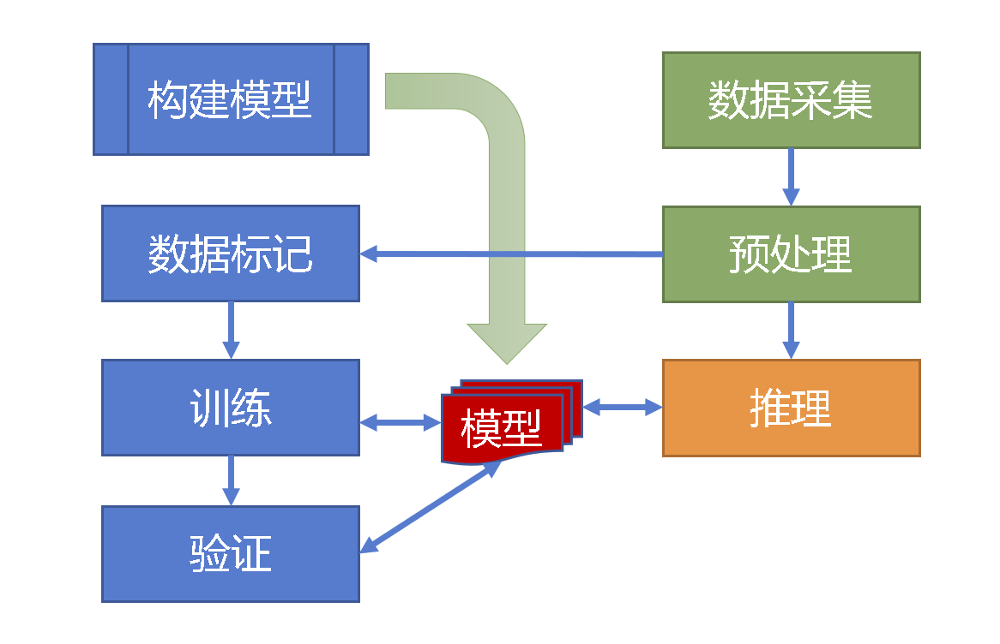
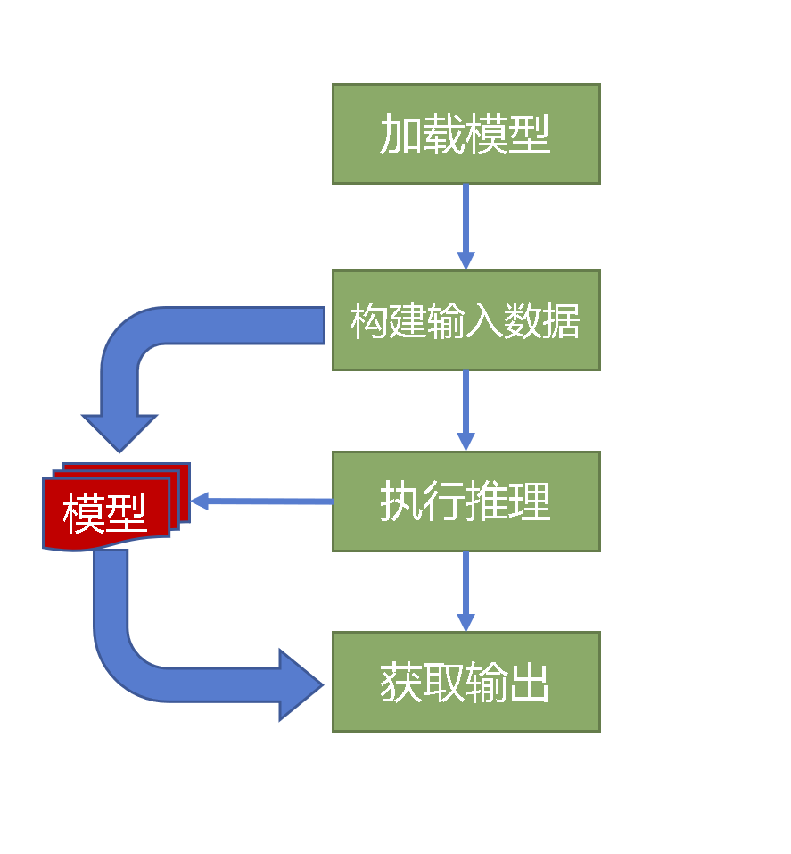

# TinyML for Predict Gesture  on ESP32-C3

## 概述

基于6轴传感器数据采样（加速度计和陀螺仪），识别两种手势动作

## 硬件

## 框架

- Tensorflow
- Keras
- Tensorflow Lite Micro

## 环境

### Python

- Python 3.8
- Tensorflow 2.9.2
- numpy 1.22.4
- PyOpenGL 3.1.6

[whl下载链接](https://www.lfd.uci.edu/~gohlke/pythonlibs/)

### Arduino

- ESP32 Arduino 2.0.3
- TensorFlowLite_ESP32 0.9.0

## 设计

### 数据

- 1.2s 数据长度，
- 100采样/s

### 模型

- 线性全连接网络
- 720-向量输入
- 2-向量输出

## 流程

数据采集

- UDP数据传输

预处理

- 滑动平均

训练

推理应用

## 代码

- Host

1. 数据采集 SensorProcess.py
1. 模型创建与训练 tinyml.py

- prediect_gesture

## 网站

- [TensorFlow Lite for Microcontrollers](https://tensorflow.google.cn/lite/microcontrollers/overview)
- [Keras Docs](https://keras.io/api/)
- [Edge Impulse](https://www.edgeimpulse.com/)
